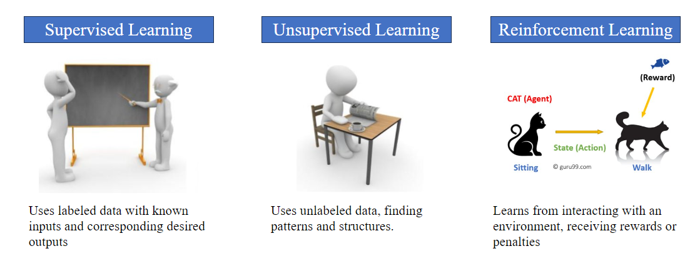

# Machine Learning
Machine Learning (ML) is a subset of artificial intelligence (AI) focused on building systems that learn from and make decisions based on data. It involves algorithms that improve automatically through experience and by the use of data. These algorithms find patterns in data and make predictions or decisions without being explicitly programmed to perform the task.

# Types of Machine Learning
 
 
# Audio Data Classification Assignment

## Overview
This assignment focuses on the application of machine learning for audio data classification. Building upon our previous work on preprocessing audio data, we now delve into the modeling process using various machine learning algorithms. The objective is to advance understanding and skills in audio data classification modeling.

## Tutorial Recap
In our last tutorial, we preprocessed audio data, which will now serve as the foundation for our machine learning models. We also explored the basics of machine learning and supervised learning, providing a theoretical background for this practical application.

## Assignment Tasks

### Tasks
1. Fork this repository into your account.
2. Create a new branch and open the jupyter notebook(from that branch).  
3. Use the combined dataset (created in the previous assignment) to train different machine learning models. 
4. Regularly commit your changes to your repository.
5. Create a detailed 1–2-page report (500-1000 words). This report should cover:
   - The modeling process and the results obtained.
   - A comparison of results from the combined dataset versus the RAVDESS-only dataset. 
   - Discussion on the observed differences in the results.
6. Upload your report in PDF format and the Jupyter Notebook file on Canvas. Ensure that these documents comprehensively cover your exploration and application of techniques in audio data classification.

## Contact
For queries or further discussions, feel free to reach out to TA( maryiam_zahoor@sfu.ca)

Credits: https://github.com/IliaZenkov/sklearn-audio-classification
